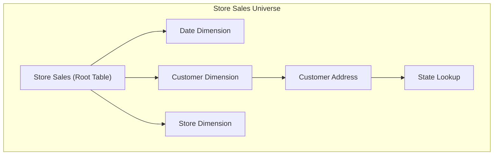

Understanding how Strata builds query paths through your semantic model.

## Overview

When you deploy a semantic model, Strata's **Formation Engine** generates all possible paths from every table to every reachable field. These paths form **universes** — complete, cardinality-safe data access routes that the query planner uses to answer user queries.

Understanding universe formation helps you:
- **Design efficient semantic models** – keep join graphs sane and avoid double-counting
- **Understand query routing** – why a particular table/universe was chosen for a query
- **Reason about dimensionality** – which dimensions are allowed to group a given measure
- **Validate measure eligibility** – why some combinations of measures/dimensions are invalid

If you are familiar with other tools, a Strata universe plays a role similar to a **BusinessObjects Universe** or a **Looker Explore**, but it is derived automatically from your YAML model and enforced with strict cardinality and routing rules.

## What is a Universe?

A **universe** is a set of paths from a single root table to all fields reachable via joins. Each table in your model has its own universe.



The Store Sales universe contains paths to:
- All fields directly on Store Sales
- All fields on Date, Customer, Store (via direct joins)
- All fields on Customer Address (via Customer)
- All fields on State Lookup (via Customer → Customer Address)

## How Universes Are Built

On deploy, the Universe Formation Engine discovers all paths from each table to every reachable field by following your join definitions. It applies cardinality and measure-expansion rules so that only valid, cardinality-safe paths are available to the query planner. You don't configure paths directly—they are derived from your semantic model.

### What You Need to Know: Measure Expansion

Not all paths allow measure aggregation. When you design joins, these rules determine whether measures can flow through a path (and thus whether a measure can be combined with dimensions on the other side of that join):

| Join Type | Measures Expand? | Why |
|-----------|-----------------|-----|
| `one_to_one` | Always | No fan-out risk |
| `many_to_one` with `allow_measure_expansion: true` | Yes | Explicitly allowed |
| `many_to_one` without flag | No | Prevents double-counting |
| `one_to_many` | No | Would multiply measures |

```yaml
# This path allows measures to flow through:
customer_address:
  cardinality: many_to_one
  allow_measure_expansion: true

# This path blocks measures (dimensions only):
customer_orders:
  cardinality: one_to_many
  # Measures from Customer cannot aggregate across Orders
```

Getting cardinality and measure expansion right is what matters when you design your semantic model; the rest is handled by the engine.

## Universe Selection

When a user creates a query with specific measures and dimensions, the planner selects which universe(s) can answer it: a universe must contain paths to **all** requested dimensions and **any** requested measures. When several universes qualify, the planner ranks them (e.g. by tier, cost, partition fit) and picks the best fit. Details are in [Semantic Routing](/docs/advanced/semantic-routing/).

**Example:** For a query like *Total Revenue by Customer State*, the Store Sales universe is used because it has the measure (Total Revenue) and can reach the dimension (Customer State via Customer → Customer Address). The Customer universe is not used because it doesn’t contain that measure. If you see errors like "dimension not in universe," it means no single universe has a path to all requested fields—often a join or cardinality issue in your model.

## Path Cost Calculation

Path cost influences table selection when multiple tables can answer the same query:

```
Total Path Cost = Base Table Cost + Σ(Join Costs)
```

```yaml
# Table costs (set in tbl.*.yml)
Store Sales: cost: 100    # Fact table - higher
Customer: cost: 10        # Dimension - lower

# Join costs (calculated from cardinality)
many_to_one: 1
one_to_one: 0
```

Lower total cost = preferred path.

## Blended Dimensions

Dimensions with the same `extended_blend_group` can be used interchangeably:

```yaml
# In tbl.store_sales.yml
- name: Sale Date
  extended_blend_group: date_dimension

# In tbl.catalog_sales.yml  
- name: Order Date
  extended_blend_group: date_dimension
```

The engine creates **blend paths** that allow queries to:
1. Use "Sale Date" when querying Store Sales measures
2. Use "Order Date" when querying Catalog Sales measures
3. Automatically blend when both measure types are requested

## Best Practices

1. **Keep join graphs simple** — Star schema is faster than complex snowflake
2. **Use appropriate cardinality** — Match actual data relationships
3. **Be careful with measure expansion** — Only enable when truly safe
4. **Use cost hints** — Lower cost on dimension tables, higher on facts
5. **Leverage tiers** — Hot datasources are preferred for performance

## Next Steps

- [Semantic Routing](/docs/advanced/semantic-routing/) — How queries select datasources
- [Cost Optimization](/docs/advanced/cost-optimization/) — Tuning table and join costs
- [Semantic Routing](/docs/advanced/semantic-routing/) — choosing a table and datasource
