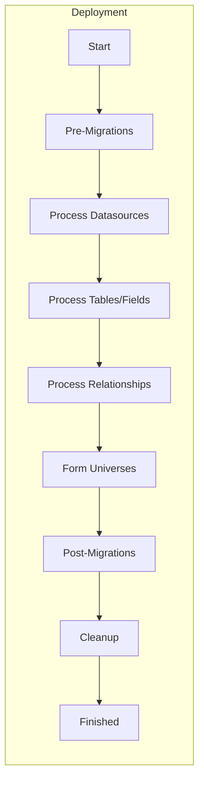

Safely rename and swap entities in your semantic model.

## Learning Objectives

After completing this guide, you will be able to:
- Create rename migrations for entities
- Create swap migrations
- Understand migration hooks (pre vs post)
- Deploy migrations safely

## What are Migrations?

Migrations track changes to your semantic model over time. They allow you to:
- **Rename entities** (dimensions, measures, tables, datasources)
- **Swap entity references** (replace one entity with another)
- **Maintain backward compatibility** during transitions

:::tip[Why Migrations Matter]
When you rename a field like "Store Name" to "Store Location", saved reports and dashboards that reference "Store Name" would break. Migrations solve this by:

1. **Updating references automatically** — The server updates all saved queries to use the new name
2. **Preserving historical data** — Query history continues to work
3. **Zero downtime** — Users don't experience broken reports

Without migrations, you'd have to manually update every saved report, or users would see errors.
:::

## Deployment Stages with Migrations

Understanding when migrations run during deployment:



- **Pre-migrations** (renames): Run before YAML processing — the old name is updated to the new name before your model files are read
- **Post-migrations** (swaps): Run after everything is loaded — swap references between entities that both exist

## Migration Types

### Rename Migrations

Rename an entity from one name to another.

**Supported entity types:**
- `dimension` - Rename a dimension field
- `measure` - Rename a measure field
- `table` - Rename a table
- `datasource` - Rename a datasource

### Swap Migrations

Swap references from one entity to another.

**Supported entity types:**
- `dimension` - Swap dimension references
- `measure` - Swap measure references
- `table` - Swap table references
- **Note:** Datasource swap is not supported

## Creating Migrations

### Rename Migration

```bash
strata create migration rename \
  --entity dimension \
  --from "Store Name" \
  --to "Store Location Name"
```

This creates a migration file in `migrations/`:
```yaml
- type: rename
  hook: pre
  entity: dimension
  from: Store Name
  to: Store Location Name
```

### Swap Migration

```bash
strata create migration swap \
  --entity measure \
  --from "Old Revenue" \
  --to "New Revenue"
```

This creates:
```yaml
- type: swap
  hook: post
  entity: measure
  from: Old Revenue
  to: New Revenue
```

## Migration Hooks

Migrations run at different times:

### Pre Hook (Default for Rename)

Runs **before** processing model definitions. Use when:
- Renaming entities that are referenced in YAML files
- Preventing deletion of old entities
- Most common for renames

```yaml
- type: rename
  hook: pre
  entity: dimension
  from: Store Name
  to: Store Location Name
```

**Workflow:**
1. Migration renames entity
2. YAML files processed with new name
3. Old name no longer exists

### Post Hook (Default for Swap)

Runs **after** processing model definitions. Use when:
- Swapping entities after all definitions loaded
- Rare cases where post-processing needed

```yaml
- type: swap
  hook: post
  entity: measure
  from: Old Revenue
  to: New Revenue
```

**Workflow:**
1. YAML files processed with original names
2. Migration swaps references
3. Old entity replaced with new

## Complete Example

### Renaming a Dimension

**Step 1:** Create migration
```bash
strata create migration rename \
  --entity dimension \
  --from "Customer Name" \
  --to "Customer Full Name"
```

**Step 2:** Update YAML files to use new name
```yaml
# models/customers/tbl.customers.yml
fields:
  - type: dimension
    name: Customer Full Name  # Updated
    data_type: string
    expression:
      sql: customer_name
```

**Step 3:** Deploy together
```bash
strata deploy
```

The migration runs first (pre hook), then YAML files are processed with the new name.

## Important Considerations

### Production Branch Warnings

⚠️ **Warning:** Renaming on non-production branches can cause issues:

- Production queries reference old entity names
- Old names don't exist in your branch
- Queries may fail

**Best practice:** Only rename on production branch, or coordinate with team.

### Deployment Order

1. **Pre-migration renames** run first
2. **YAML files** processed
3. **Post-migration swaps** run last

Deploy migrations and updated YAML files in the same deployment.

## Migration File Naming

Migration files are automatically named with timestamp:

```
migrations/20260115004653_rename_store_name_to_store_location_name.yml
```

Format: `YYYYMMDDHHMMSS_description.yml`

## Version Tracking

Each deployment creates a version record that tracks:
- Which migrations were applied
- What entities were added, modified, or deleted
- Timestamp and deployment metadata

This enables:
- **Audit trail** — See who changed what and when
- **Rollback planning** — Understand what to revert if needed
- **Incremental deploys** — Only process changed files

## Best Practices

1. **Rename on production branch** — Avoid breaking production queries
2. **Update YAML files** — Change references in same deployment
3. **Use pre hook for renames** — Most common pattern
4. **Test migrations** — Verify in development first
5. **Document changes** — Add comments explaining why
6. **One migration per change** — Don't combine unrelated renames
7. **Coordinate with team** — Communicate before renaming widely-used fields

## Troubleshooting

### Migration Not Applied

- Check migration file syntax
- Verify entity names match exactly (case-sensitive)
- Ensure migration is in `migrations/` directory

### Entity Not Found

- Verify old entity name exists
- Check for typos in `from` field
- Ensure entity type matches

### Production Queries Broken

- Rename only on production branch
- Coordinate with team before renaming
- Consider gradual rollout

## Next Steps

- Learn about [deployment](/docs/cli/deployment/)
- See migration structure in this guide
- Explore [testing](/docs/cli/tests/) to validate changes
